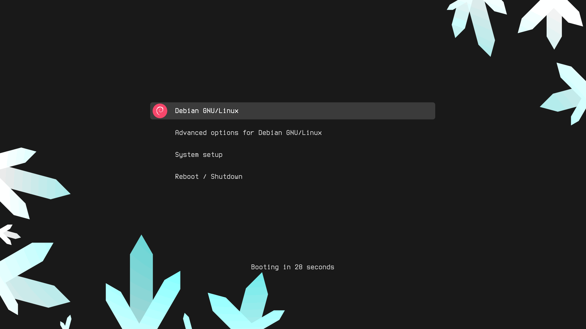
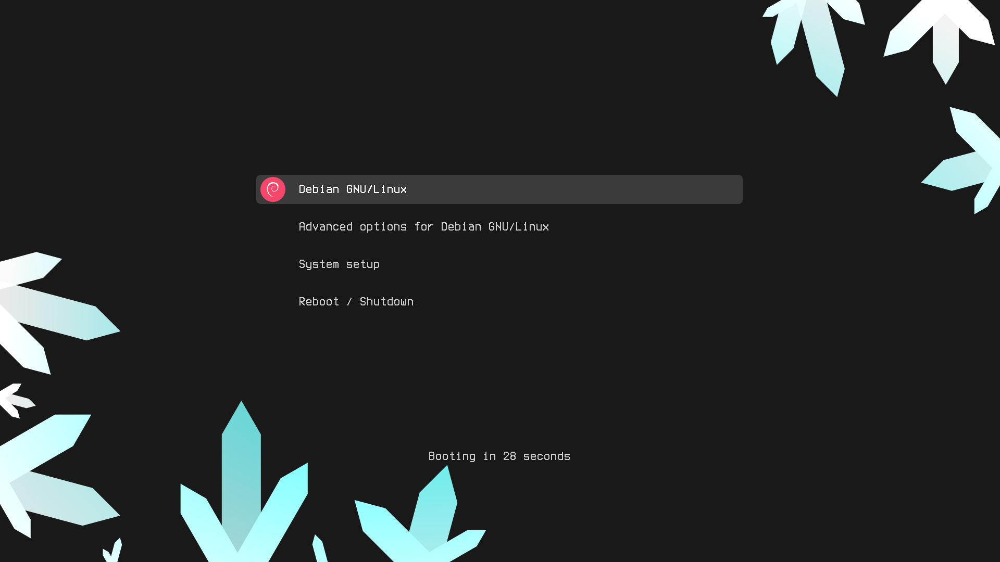
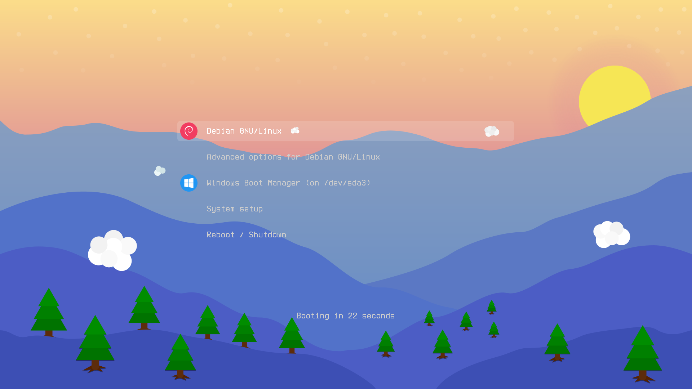
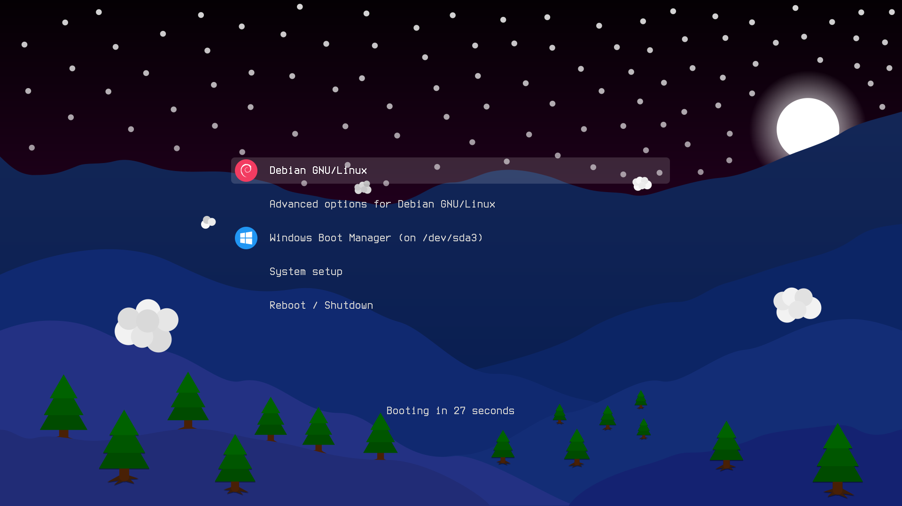
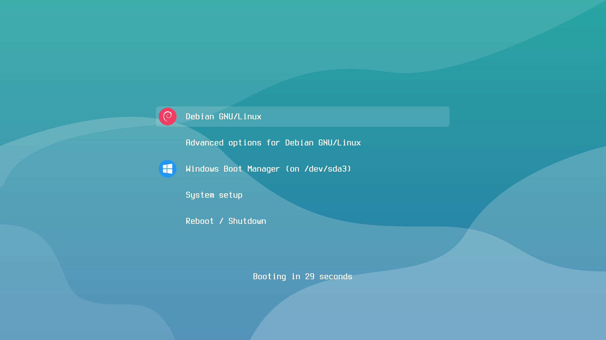
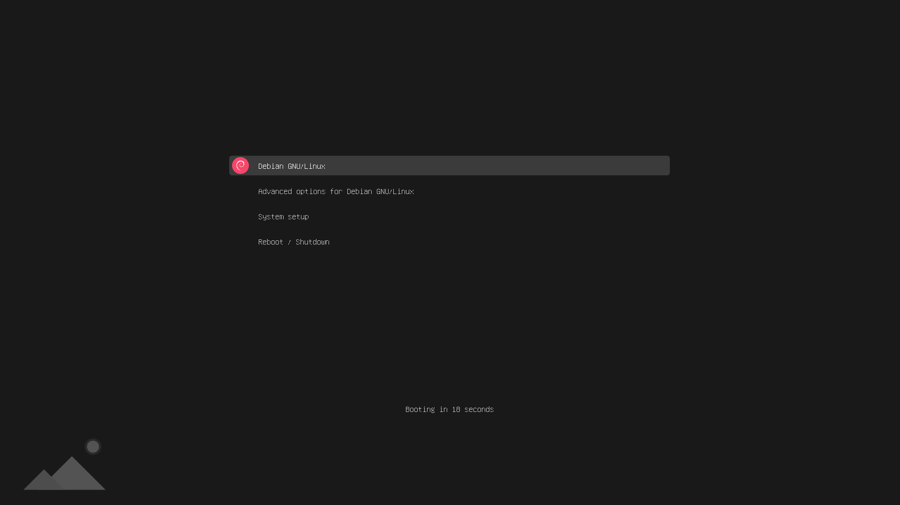
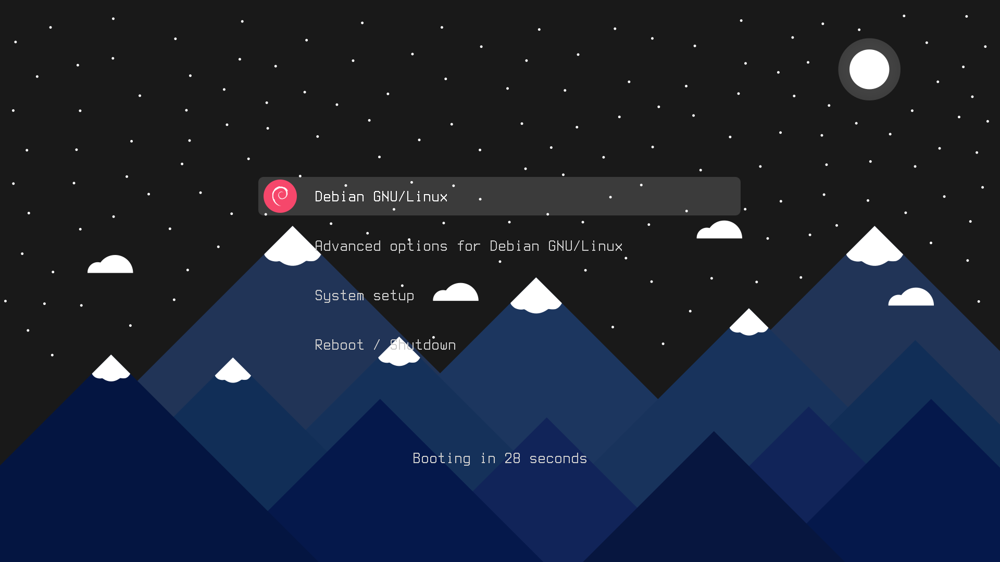
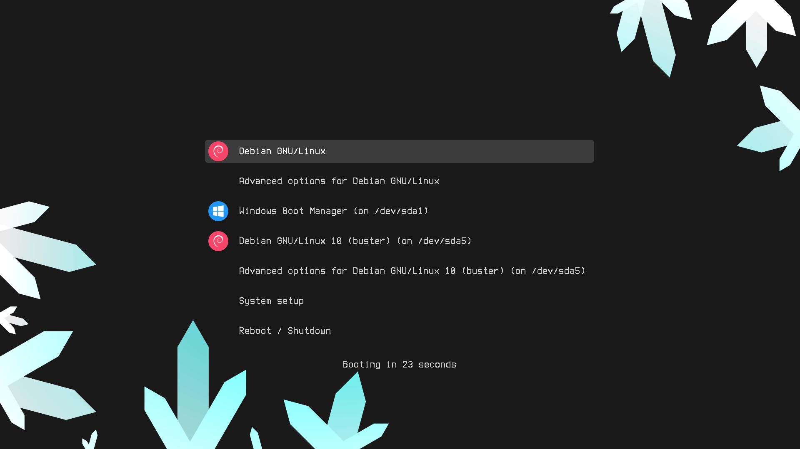
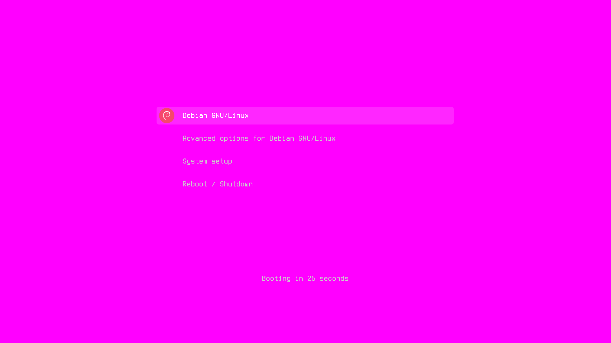

## argon-grub-theme

 - Configurable, modern theme for the GRUB, containing backgrounds, icons, fonts and styling
   - Backgrounds, fonts and fontsize can all be customised
   - Wallpaper source files can be found [here](https://github.com/stuarthayhurst/argon-wallpapers)
   - Some of the icons used are from [here](https://github.com/vinceliuice/grub2-themes)
 - Any donations are greatly appreciated :)

## Installation:

Usage:  `sudo ./install.sh [OPTIONS]`

|  Options:         | Description: |
|:------------------|:-------------|
| -h , --help       | Show a help page |
| -i , --install    | Install the grub theme (root) |
| -u , --uninstall  | Uninstall the grub theme (root) |
| -e , --boot       | Install the grub theme into `/boot/grub/themes` |
| -p , --preview    | Preview the grub theme (Works with other options, non-root) |
| -b , --background | Choose a background image (must be a .png, or bundled with the project)   - Leave blank to view available backgrounds|
| -c , --custom     | Use a solid colour as a background (HTML value, must be quoted)
| -r , --resolution | Select the display resolution   - Leave blank to view available resolutions |
| --icons           | Choose whether to use `coloured` or `colourless` icons |
| -f , --font       | Specify which font to use (file)   - Leave blank to view available fonts |
| -fc, --fontcolour | Use a specific font colour (HTML (must be quoted) and SVG 1.0 colours supported)   - Use the format: -fc "textcolour,selectedcolour" |
| -fs, --fontsize   | Use a specific font size |
| -l , --bold       | Force font to be bold |
| -hl, --help-label | Add a help label to the bottom of the theme |

Required arguments: [--install + --background / --uninstall / --preview]
 - **If the repository is updated, `make clean` should be run, to erase cached assets**

## Examples:
 - Install the theme for a 4k display, using the `Night` wallpaper:
   - `sudo ./install.sh --install --resolution 4k --background Night`

 - Install the theme for a 4k display, using the `Night` wallpaper and a font size of 32:
   - `sudo ./install.sh --install --resolution 4k --background Night --fontsize 32`

 - Install the theme for an unknown resolution, using the `Crystals` wallpaper:
   - `sudo ./install.sh --install --resolution custom --background Crystals`

 - Install the theme for a custom resolution (1024x720), using a solid magenta wallpaper:
   - `sudo ./install.sh --install --resolution 1024x720 --custom #ff00ff`

 - Preview the theme with a fontsize of 32, a white font colour and black selected font colour:
   - `./install.sh -p -b Crystals -fs 32 -fc "white,#000000"`

 - Preview the theme with a different font:
   - `./install.sh -p -b Crystals -f Terminus.ttf`

 - Install the theme into /boot/grub/themes:
   - `sudo ./install.sh -i -e -b Night`

 - Uninstall the theme:
   - `sudo ./install.sh -u`

## Screenshots:

 - Some individual images at end of document

## Dependencies:
  #### Mandatory:
 - `make` - Used for the build system
 - `imagemagick / convert` - Used to generate backgrounds with custom colours
 - `inkscape` - Used to generate pngs from svgs (Used by `make generate-all`)
   - `inkscape` is needed if the fontsize used isn't 16, 24 or 32
  #### Optional:
 - `python3` - Used when generating icons, or when using a custom fontsize
 - `optipng` - Used to losslessly compress pngs (Used by `make compress-backgrounds`, `make generate-gif`, `make generate-icons` and `make generate-select`)
 - `grub2-theme-preview` - Used to preview themes (Used by --preview)

## Updating:
 - Update the repository: `git clone https://github.com/stuarthayhurst/argon-grub-theme.git`
 - **Clear the asset cache: `make clean`**
 - Install like normal

## Preview the theme:
 - Follow the instructions at [grub2-theme-preview](https://github.com/hartwork/grub2-theme-preview) to install the program
 - Run the install script with your desired options, but replace --install / -i with --preview / -p
 - For example: `./install.sh --preview --background Crystals.png --resolution 4k`

## Using a different resolution:
 - Use `./install.sh -r` to list available resolutions, and `./install.sh -r [RESOLUTION]` to use one
 - Any resolution can be used with `./install.sh -r custom` and a custom background

## Using a custom background:
 - Find the resolution of your display, and make sure your background matches the resolution
 - Place your custom background inside the root of the project
 - Run the installer like normal, but with `--background [filename.png]` and `--resolution [YOUR_RESOLUTION]`
   - Resolutions:
     - 16:9: (`1920x1080` -> 1080p, `2560x1440` -> 2k, `3840x2160` -> 4k)
     - 16:10: (`1920x1200`, `2240x1400`, `3840x2400`)
   - Make sure to replace `[YOUR_RESOLUTION]` with your resolution and `[THEME]` with the theme

## Forcing an icon:
 - Find the name / class of the icon in `assets/svg/icons/`
   - For example, `assets/svg/icons/linuxmint.svg` would be `linuxmint`
 - Add the class to the corresponding entry in `/boot/grub/grub.cfg`:
   - Change: `menuentry 'Linux Mint 18.3 Cinnamon 64-bit' --class ubuntu --class gnu-linux --class gnu`
   - To: `menuentry 'Linux Mint 18.3 Cinnamon 64-bit' --class linuxmint --class ubuntu --class gnu-linux --class gnu`
 - Save the file and exit

## Adding your own icon:
 - Add a `32x32` `.svg` of the icon into `assets/svg/icons/`
   - If using colourless icons or planning to push the changes upstream, put a colourless copy in `assets/svg/icons-colourless`
 - Make sure `inkscape`, `python3` and `optipng` are installed
 - Run `make generate-icons -j$(nproc)`
 - Install as normal
 - If those dependencies can't be installed, or you can't use a `.svg`, place `32x32`, `48x48` and `64x64` versions of the icon in the corresponding directories in `assets/icons/`
 - Install as normal, but if `--fontsize` is used, the custom icon won't be used

## Gallery:

## Makefile options:
 - Makefile respects core count specified by `-j[Core count]`
 - `make clean` - Remove assets generated at build time
 - `make full-clean` - Remove all generated assets
 - `make generate-all` - Generate all assets
 - `make compress-backgrounds` - Compress backgrounds losslessly

## Contributing:
 - If you made changes to any images, or added a new one:
   - Run `make full-clean`
   - Run `make generate-all`
 - If the change was to a background, scale the background for each resolution, then:
   - Run `make compress-backgrounds`
 - Create a pull request from your branch or fork
 - If any issues occur, report them to the [issue](https://github.com/stuarthayhurst/argon-grub-theme/issues) page
 - Thank you :)

## Copyright and credits:
 - Terminus font: Copyright (c) 2019 Dimitar Toshkov Zhekov, `fonts/Terminus-License.txt`
 - DejaVu fonts: See `fonts/DejaVu-License.txt`
 - Unifont: The GNU Project - `fonts/Unifont-License.txt`
 - Theme originally based off of [grub2-themes](https://github.com/vinceliuice/grub2-themes)
   - Code is upstreamed where possible
