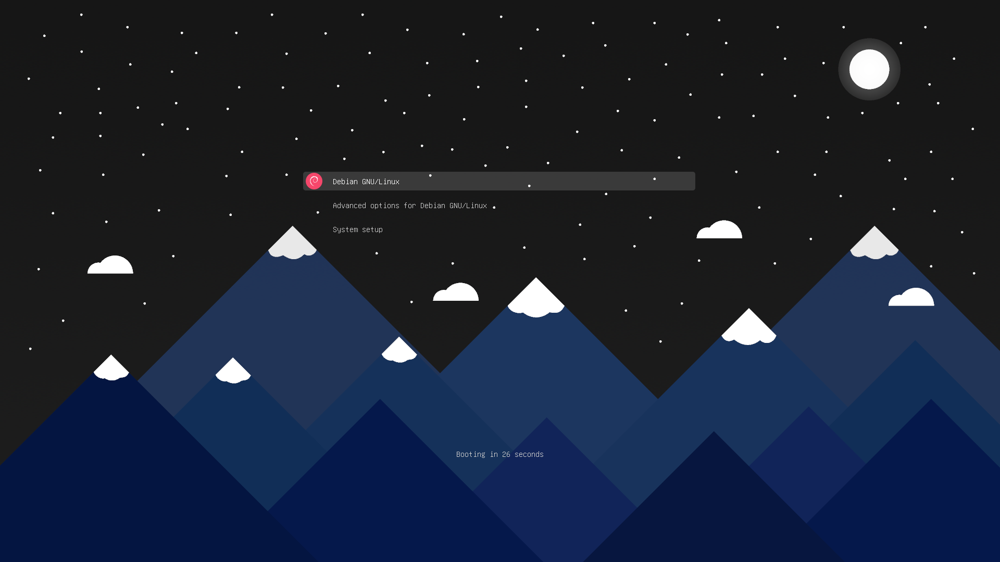
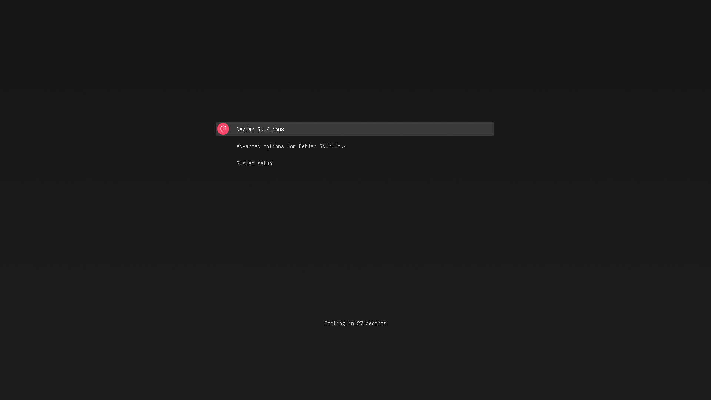

## argon-grub-theme
 - Modern theme for the grub bootloader, containing backgrounds, icons, fonts and styling
 - Wallpaper source files can be found [here](https://github.com/Dragon8oy/argon-wallpapers)

## Installation:

Usage:  `sudo ./install.sh [OPTIONS]`

|  Options:            | Description: |
|:---------------------|:-------------|
| -h , --help          | Show a help page |
| -i , --install       | Install the grub theme |
| -u , --uninstall     | Uninstall the grub theme |
| -e , --boot          | Install the grub theme into `/boot/grub/themes` instead |
| -p , --preview       | Preview the grub theme (Works with other options) |
| -b , --background    | Choose a background image (must be a .png, or bundled with the project) |
| -r , --resolution    | Select the display resolution |
| -fs, --fontsize      | Use a specific font size (10-32) |
| -g , --generate      | Generate the theme's assets |
| -c , --compress      | Compress the theme's assets losslessly |
| --clean              | Delete all the theme's assets |
Required arguments: [--install + --background / --uninstall / --generate / --compress / --clean]

## Examples:
 - Install the theme for a 4k display, using the `Night` wallpaper:
   - `sudo ./install.sh --install --resolution 4k --background Night`

 - Install the theme into /boot/grub/themes:
   - `sudo ./install.sh -i -e -b Night`

 - Uninstall the theme:
   - `sudo ./install.sh -u`

## Screenshots:

## Dependencies:
 - `inkscape` - Used to generate pngs from svgs (Used by --generate)
 - `optipng` - Used to losslessly compress pngs (Used by --compress)
 - `grub2-theme-preview` - Used to preview themes (used by --preview)

## Preview the theme:
 - Follow the instructions at [grub2-theme-preview](https://github.com/hartwork/grub2-theme-preview) to install the program
 - Run the install script with your desired options, but replace --install / -i with --preview / -p
 - For example: `./install.sh --preview --background Crystals.png --resolution 4k`

## Using a custom background:
 - Find the resolution of your display, and make sure your background matches the resolution
 - Place your custom background inside the root of the project
 - Run the installer like normal, but with `--background [filename.png]` and `-- resolution [YOUR_RESOLUTION]`
   - Resolutions: (1920x1080 -> --1080p, 2560x1080 -> --ultrawide, 2560x1440 -> --2k, 3840x2160 -> --4k)
   - Make sure to replace `[YOUR_RESOLUTION]` with your resolution and `[THEME]` with the theme

## Contributing:
 - If you made changes to any images, or added a new one:
   - Run `./install.sh --clean`
   - Run `./install.sh --generate`
   - Run `./install.sh --compress`
 - Create a pull request from your branch or fork
 - If any issues occur, report then to the [issue](https://github.com/Dragon8oy/argon-grub-theme/issues) page
 - Thank you :)

## Copyright and credits:
 - Terminus font: Copyright (c) 2019 Dimitar Toshkov Zhekov
 - DejaVu fonts: See `fonts/DejaVu-License.txt`
 - Theme originally based off of [grub2-themes](https://github.com/vinceliuice/grub2-themes)
   - Code is upstreamed where possible
